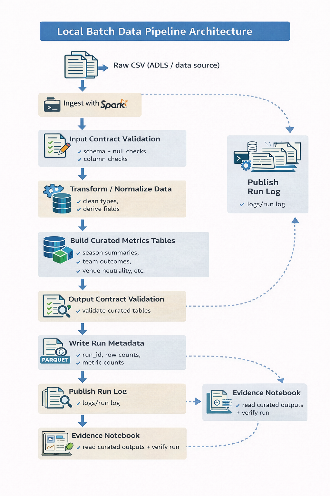

# Azure Batch Data Pipeline for Historical NFL Game Analytics

## One-line summary

A contract-first Azure batch data pipeline built on Synapse Spark that ingests historical NFL game data, validates it with strict schema contracts, computes deterministic season metrics, and publishes run-scoped outputs to ADLS with a structured execution log.

---

## Business / engineering problem

Historical sports datasets often contain inconsistent records, missing values, and mixed future and completed events. Without strict validation and deterministic processing, analytics tables built from such data can become unreliable and difficult to reproduce.

This project solves that problem by implementing a contract-first batch pipeline that:

- strictly validates input data before transformation  
- computes deterministic metrics from completed games only  
- publishes curated outputs in a run-isolated storage layout  
- records a structured run log that acts as the single source of truth for execution

The goal is not complex analytics, but reliable, reproducible batch engineering.

---

## Architecture overview



Pipeline flow:

Raw CSV input (ADLS)  
→ contract validation of raw dataset  
→ transformation into curated dataset  
→ deterministic metric computation (M1–M6)  
→ curated and metric tables written to ADLS  
→ run metadata written to `run.log`  
→ evidence notebook used for historical verification

The pipeline executes inside **Azure Synapse Spark** and is triggered by a **Synapse pipeline**.

---

## Tech stack

- Python
- PySpark
- Azure Synapse Spark
- Azure Data Lake Storage Gen2
- Parquet
- Git / GitHub

Only technologies actually used in the pipeline are listed.

---

## Project structure

```
azure-batch-data-product/

├── README.md
├── LICENSE
├── .gitignore
├── requirement.txt

├── data/
│   └── spreadspoke_scores.csv

├── docs/
│   ├── architecture.png
│   └── pipeline_flow.png

├── logs/
│   └── run.log

├── evidence/
│   └── evidence_notebook.ipynb

├── framework/
│   └── batch_framework.md

└── src/
    ├── contracts/
    │   ├── input_contract.py
    │   └── output_contracts.py
    │
    ├── jobs/
    │   ├── ingest_validate_transform.py
    │   └── build_and_publish.py
    │
    └── runner/
        └── run_azure_batch.py
```

Key directories:

- **src/contracts** — strict input and output schema validation  
- **src/jobs** — ingestion, transformation, and metric computation  
- **src/runner** — orchestration logic for the batch run  
- **logs** — execution metadata (`run.log`)  
- **docs** — architecture and pipeline diagrams  
- **evidence** — historical verification notebook  

---

## Key engineering features

This project demonstrates production-minded data pipeline design.

- Contract-first validation before any transformation
- Explicit separation between ingestion, transformation, and publishing
- Deterministic batch computation (full recompute each run)
- Run-scoped output isolation in ADLS
- Structured run log acting as execution source of truth
- Failure-safe publishing (metrics removed on failed runs)
- Evidence-driven verification approach

The system prioritizes clarity, determinism, and reliability over complexity.

---

## How to run

This pipeline executes inside **Azure Synapse**.

### Prerequisites

- Azure Synapse workspace
- Spark pool available
- ADLS Gen2 container containing:

```
raw/spreadspoke_scores.csv
code/azure_batch_code.zip
```

---

### Step 1 — Synapse notebook execution cell

The notebook loads the packaged code and invokes the batch runner.

```python
import sys

zip_path = "abfss://data@<batchrawdata>.dfs.core.windows.net/code/azure_batch_code.zip"
sys.path.insert(0, zip_path)

from src.runner.run_azure_batch import main

sys.argv = [
    "run_azure_batch",
    "--input_path", "abfss://data@<batchrawdata>.dfs.core.windows.net/raw/spreadspoke_scores.csv",
    "--curated_base", "abfss://data@<batchrawdata>.dfs.core.windows.net/curated",
    "--metrics_base", "abfss://data@<batchrawdata>.dfs.core.windows.net/metrics",
    "--logs_base", "abfss://data@<batchrawdata>.dfs.core.windows.net/logs",
]

main()
```

The notebook contains only this execution cell.  
All guarantees are enforced inside the runner.

---

### Step 2 — Trigger the Synapse pipeline

1. Open **Synapse Studio**
2. Navigate to **Integrate → Pipelines**
3. Open the batch pipeline
4. Click **Trigger → Trigger now**

Execution flow:

Synapse Pipeline  
→ Synapse Notebook  
→ Batch runner  
→ ADLS outputs + run log

---

## Storage layout (ADLS Gen2)

After a successful run:

```
curated/run_id=<run_id>/
metrics/run_id=<run_id>/M1..M6
logs/run_id=<run_id>/run.log
```

Example structure:

```
curated/run_id=<run_id>/curated.parquet
metrics/run_id=<run_id>/M1
metrics/run_id=<run_id>/M2
metrics/run_id=<run_id>/M3
metrics/run_id=<run_id>/M4
metrics/run_id=<run_id>/M5
metrics/run_id=<run_id>/M6
logs/run_id=<run_id>/run.log
```

---

## Run evidence

Each batch execution produces a single structured log:

```
logs/run_id=<run_id>/run.log
```

Fields include:

- run_id
- input_path
- curated_path
- metrics_root
- rows_read_raw
- rows_curated
- per_metric_rows
- status
- failure_reason (if failed)

Interpretation:

If `"status": "success`  
→ metrics were published

If `"status": "failed"`  
→ partial outputs were removed

The run log acts as the authoritative record of pipeline execution.

---

## Evidence notebook

The repository contains a read-only **evidence notebook** used to inspect run artifacts.

Purpose:

- review the committed run log
- demonstrate how run outputs were inspected
- document the verification process used during execution

The notebook is preserved as **historical verification evidence**, not as a recomputation environment.

---

## Design principles

- Contract-first validation
- Deterministic full recompute batch
- Explicit reconciliation invariants
- Run-isolated output publishing
- No enrichment joins
- No imputation
- No partial publish
- Evidence over claims

The system intentionally favors clarity and reliability over complexity.

---

## What this project proves

This repository demonstrates:

- Azure batch pipeline design
- Contract-driven data validation
- Deterministic metric computation
- Run-scoped storage architecture
- Reproducible batch execution patterns
- Evidence-driven data engineering practices

It represents a small but production-minded cloud batch data pipeline.